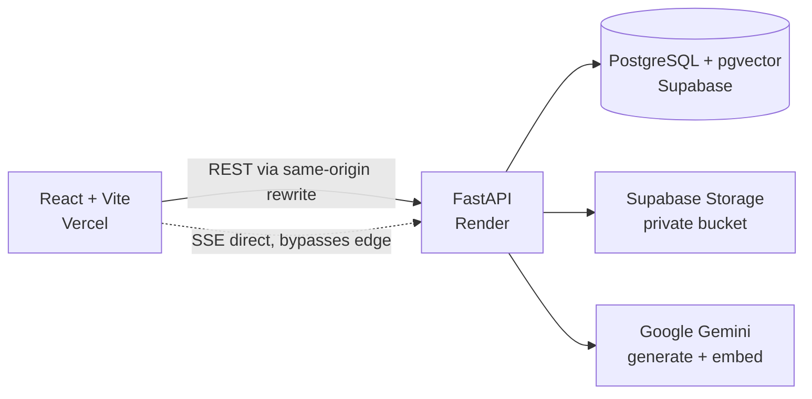

# PDF Intelligence & Collaboration System

Upload a PDF, get an AI summary in seconds, ask grounded questions with page-level
citations, and share it with anyone — no account required for them to read and comment.

**Live demo:** https://pdf-intelligence-collaboration-syst.vercel.app
**API docs:** https://pdf-intel-api.onrender.com/docs
**Video walkthrough:** [ADD LOOM LINK]

> ⚠️ The API runs on Render's free tier and sleeps when idle. **The first request after a
> quiet period takes ~50 seconds** while the instance wakes. Everything after that is fast.
> If the page seems stuck on first load, give it a minute.

---

## Features

**All nine must-haves**

- Email/password auth — bcrypt (cost 12), JWT access tokens, rotating refresh tokens
- PDF upload validated by magic bytes, MIME type, extension and size — not just the extension
- Dashboard with per-document AI summaries, upload dates, and search
- Full PDF viewer with page navigation, zoom and fit-width
- Shareable links — invitees need no account
- Comment sidebar for both owners and invitees, with threaded replies
- Automatic AI summary on upload (3–5 sentences, named parties/dates/amounts)
- AI chat grounded in the document, with conversation memory and page citations
- Access control, hashed passwords, server-side-only API keys, responsive down to 375px

**Both good-to-haves attempted, implemented**

- Token-by-token streaming of AI responses (SSE)
- Embedding-based semantic search across document content
- Threaded comment replies with bold/italic/bullet formatting

**Not implemented** — password reset and share-notification emails. See
[Known limitations](#known-limitations-and-trade-offs).

---

## Architecture



| Layer | Choice | Why |
|---|---|---|
| API | FastAPI (async) | Native SSE streaming; LLM calls are I/O-bound |
| PDF | PyMuPDF | Fast, gives per-page text — the basis for page citations |
| Vectors | pgvector in the same Postgres | One datastore, no extra service to operate |
| LLM | Google Gemini | Large context, free tier, embeddings from the same provider |
| Storage | Supabase private bucket | Authorization in the API; files served via short-lived signed URLs |

### Two deployment details worth explaining

**The API is same-origin.** `frontend/vercel.json` rewrites `/api/*` to Render, so the
browser only ever sees one origin. That keeps the refresh cookie first-party with
`SameSite=Lax` — a `SameSite=None` cookie would be a third-party cookie, which Safari
blocks by default and Chrome blocks in incognito, which is exactly where the share link
gets demoed.

**Chat is the one exception.** The SSE endpoint is called directly at the Render origin
(`VITE_STREAM_BASE_URL`), bypassing the rewrite, because edge proxies buffer streamed
responses. Through the rewrite the answer still arrives — all at once, at the end, which
silently deletes the streaming. That route authenticates with a bearer token, so it needs
no cookie and has no third-party-cookie problem.

---

## 🎯 AI Approach

### Which LLM

`gemini-3.6-flash` for summarisation and chat, `gemini-3.5-flash-lite` for the cheap
query-rewriting step, and `gemini-embedding-001` (768-d, Matryoshka-truncated) for
embeddings. Chosen for the large context window — most documents fit whole, so
summarisation doesn't lose information to chunking — and a free tier sufficient here.
Model IDs come from settings, never hardcoded in service code.

### How prompts are structured

**Summarisation.** The prompt assigns a role ("document analyst"), names the audience
("a professional who has not read it"), and leans on *negative* constraints — no
preamble, no meta-commentary, never infer beyond the text — because the default failure
mode of a summarisation prompt is a fluent generic restatement. It demands concrete
anchors (named parties, dates, amounts), which makes the output falsifiable rather than
merely plausible. Output is forced into a JSON schema (`doc_type`, `summary`,
`key_points`) via structured-output mode, so the dashboard renders a type badge and
highlights rather than parsing prose. Temperature 0.2.

**Chat.** The system prompt restricts the model to the supplied excerpts, requires a
`[p. N]` citation for every claim, and specifies **the exact refusal wording** for
information the document doesn't contain. Temperature 0.1 — lower than summarisation,
because chat has to reproduce amounts and clause numbers verbatim and every degree of
freedom is a chance to paraphrase a figure into something plausible but wrong.

Three lines of that prompt do most of the work, and it's worth being specific about why:

1. **Specifying the refusal sentence, not just asking for one.** Told merely "say so if
   you don't know", the model hedges politely and hallucinates anyway. Given a template
   it must reproduce, it refuses cleanly. Asked *"what is the CEO's home address?"* about
   a placement agreement, it answers: *"I couldn't find anything about the address of the
   CEO in this document."*

2. **The partial-answer rule** — "if the excerpts partially answer, give what is
   supported and state the gap." Without it the model treats "some of this is here" as
   either a full answer or a refusal, and both are wrong. Asked about a price the document
   never states, it explains the fee structure it *can* support with `[p. 2]` citations,
   then names what's missing. That middle case is the realistic one and the easiest to
   get wrong.

3. **"Quote exact wording"** for terms, numbers and dates — so a ₹ figure or a clause
   number survives verbatim instead of being paraphrased into plausibility.

### 🎯 Handling long documents

**Summaries.** Documents under 400,000 characters are sent whole. Above that, a
map-reduce pass: split into ~30k-character sections on paragraph boundaries, summarise
each into factual bullets concurrently (semaphore-limited to 5), then reduce those
bullets through the identical final-summary prompt. Nothing is silently truncated, and
both paths produce the same shape of answer.

**Chat.** Retrieval-augmented generation. Text is split into ~1,000-token page-aware
chunks with 150-token overlap, preferring paragraph boundaries, each embedded and stored
in pgvector with an HNSW cosine index.

At query time:

1. **Query rewriting.** If there's prior conversation, the follow-up is rewritten into a
   standalone query — *"and what about termination?"* → *"termination clause notice
   period in the employment agreement"*. This is the step that makes follow-ups work.
   Replaying chat history to the model is not enough: by then the wrong chunks have
   already been retrieved.
2. **Hybrid retrieval** — top 12 by vector cosine similarity, top 12 by Postgres
   full-text `ts_rank`, fused with Reciprocal Rank Fusion (k=60). Pure vector search is
   weak on exact identifiers ("Section 8.2", "₹4,50,000", "Clause XI"), which is most of
   what people actually ask contracts about. The two searches run concurrently on
   separate sessions, which removes a full database round trip from the latency before
   the first token.
3. **RRF rather than a weighted score blend**, because cosine distance and `ts_rank`
   aren't on a common scale and their distributions shift per query. Fusing on *rank* is
   scale-free and needs no tuning.
4. The top 6 chunks go into the prompt **ordered by position in the document**, not by
   score — ranking decides *which* chunks, position decides how they're *presented*, and
   relevance order produces answers that read as disjointed.
5. The last 5 conversation turns are replayed for continuity.

Each answer exposes a **"Grounded in N excerpts"** panel showing the retrieved passages
and whether each was found by `vector`, `text`, or both — so the retrieval is inspectable
rather than something you have to take on trust.

**Dashboard semantic search** reuses the same embeddings: the query is embedded, matched
against chunks (best passage per document) and against each document's own
`summary_embedding`, then merged with filename matches. Filename hits always rank first —
someone typing a filename is navigating, not discovering. Every result shows why it
matched.

**One honest caveat on chunk sizing.** There's no Gemini tokenizer available locally and
`tiktoken` is OpenAI's, so token counts are estimated at 4 characters per token. Chunk
sizes are therefore approximate. That's fine for retrieval, which is insensitive to ±15%
chunk size, but it means the chat prompt leaves headroom rather than packing the context
window to an exact limit.

---

## Local setup

### Prerequisites

Python 3.12+, Node 20+, a PostgreSQL 15+ database with `pgvector` (a free Supabase
project has it pre-installed), and a Google AI Studio API key.

### 1. Clone and configure

```bash
git clone https://github.com/sab-x/pdf-intelligence-collaboration-system.git
cd pdf-intelligence-collaboration-system
cp .env.example backend/.env    # then fill in the values
```

### 2. Database

```sql
CREATE EXTENSION IF NOT EXISTS vector;
CREATE EXTENSION IF NOT EXISTS pg_trgm;
CREATE EXTENSION IF NOT EXISTS citext;
```

`pgvector` must be **0.5 or newer** — migration 0005 creates an HNSW index.

Two connection strings are needed. `DATABASE_URL` points at the transaction pooler
(port 6543) for the app; `MIGRATION_DATABASE_URL` points at the session pooler
(port 5432) for Alembic, because DDL fails on the transaction pooler.

### 3. Backend

```bash
cd backend
uv sync
uv run alembic upgrade head
uv run uvicorn app.main:app --reload --port 8000
# API at http://localhost:8000 · docs at http://localhost:8000/docs
```

### 4. Frontend

```bash
cd frontend
npm install
npm run dev
# App at http://localhost:5173
```

No frontend `.env` is needed locally — Vite's dev proxy forwards `/api` to port 8000, and
`VITE_STREAM_BASE_URL` is only set in production.

### 5. Tests

```bash
cd backend
export TEST_DATABASE_URL="postgresql+asyncpg://...:5432/postgres"   # a THROWAWAY database
uv run pytest
```

`conftest.py` runs `create_all` / `drop_all`. **Never point `TEST_DATABASE_URL` at a
database with real data.**

### Environment variables

| Variable | Required | Where to get it |
|---|---|---|
| `DATABASE_URL` | ✅ | Supabase → Settings → Database (pooler, port 6543) |
| `MIGRATION_DATABASE_URL` | ✅ | Same, port 5432 (session pooler) |
| `JWT_SECRET` | ✅ | `python -c "import secrets; print(secrets.token_urlsafe(64))"` |
| `GEMINI_API_KEY` | ✅ | https://aistudio.google.com/apikey |
| `SUPABASE_URL` / `SUPABASE_SERVICE_KEY` | ✅ | Supabase → Settings → API |
| `SUPABASE_BUCKET` | ✅ | Create a **private** bucket named `documents` |
| `FRONTEND_URL` | ✅ | Used for CORS and for building share links |
| `VITE_STREAM_BASE_URL` | production only | The API origin, so SSE bypasses the edge proxy |

Full list with defaults in [`.env.example`](.env.example).

---

## Deployment

| Component | Platform | Notes |
|---|---|---|
| Frontend | Vercel | Root `frontend`, Vite preset, `VITE_STREAM_BASE_URL` set to the API origin |
| API | Render | Root `backend`, region Singapore (near the Seoul database) |
| Database | Supabase Postgres | `vector`, `pg_trgm`, `citext` enabled |
| Files | Supabase Storage | Private bucket, 15-minute signed URLs |

Render builds from `backend/requirements.txt` (exported from `uv.lock` — regenerate with
`uv export --no-hashes --no-dev --format requirements-txt -o requirements.txt` whenever a
dependency changes). Migrations are run manually rather than on boot, so a bad migration
can't take the service down on restart.

---

## Security

- bcrypt (cost 12) password hashing; plaintext never stored, logged, or returned. Inputs
  over bcrypt's 72-byte limit are rejected explicitly rather than silently truncated
- Short-lived access tokens; refresh tokens in httpOnly, Secure, SameSite=Lax cookies,
  with the `jti` tracked server-side so rotation and logout actually revoke — a stateless
  refresh token would stay valid for its full 7 days after logout
- Every document/comment/chat route passes through a single `require_document_access()`
  dependency. **404, never 403, for anyone with no relationship to a document** — a
  stranger shouldn't learn it exists. A caller who holds a valid share link but
  insufficient permission gets 403, since they already know it exists; a test asserts
  that 403 can never become an existence oracle
- Guest tokens from share links are scoped to a single document, and access is re-derived
  from the database on every request — revoking a link takes effect immediately rather
  than when the 24-hour token expires
- Share tokens are 256-bit (`secrets.token_urlsafe(32)`), revocable, optionally expiring
- Chat sessions are authorized against the calling principal, not just the document —
  otherwise a guest with a valid link could read the owner's chat history by guessing a
  session id
- Files live in a private bucket; URLs are signed for 15 minutes and minted only after an
  authorization check (pdf.js issues Range requests across a viewing session, so a shorter
  TTL breaks large documents mid-scroll)
- Storage keys are derived from UUIDs, never from user-supplied filenames
- Comment markdown is sanitized on render with a narrow allowlist; no `dangerouslySetInnerHTML`
- Rate limits on auth, guest-session creation, upload and chat, plus a per-document daily
  message cap
- No API key ever reaches the browser; all LLM calls are server-side

---

## 🎯 Known limitations and trade-offs

Written honestly, because the brief asks for it.

- **Password reset and share-notification emails are not implemented.** With a 3-day
  window I spent the time on the AI features and the access-control model instead.
  `share_links.invited_email` is captured and stored — only the sending layer is missing,
  and the UI says so rather than leaving a dead field. Worth noting the delivery problem
  too: on a free email provider without a verified domain you can only send to your own
  address, so a half-built version would have worked in my testing and silently failed
  for anyone else.
- **Ingestion runs in FastAPI background tasks, not a durable queue.** A restart during
  processing leaves a document stuck in `processing`. Production would use Arq or Celery
  with a retry policy.
- **Scanned/image-only PDFs are detected and rejected rather than OCR'd.** The document is
  marked failed with an explanatory message instead of producing an empty summary.
- **Embedding failure degrades rather than fails.** If the embedding API errors, chunks
  are still written with `embedding = NULL` and the document still becomes `ready` —
  full-text retrieval keeps working and only the vector half is lost. Better than
  discarding a good summary over one API timeout, but such a document answers less well
  until re-uploaded.
- **Chunk boundaries can split tables**, so table-heavy documents answer less reliably
  than prose. Layout-aware extraction would fix this.
- **Comments aren't anchored to text selections**, only optionally to a page number.
- **No realtime.** Comments appear on refetch, not by websocket push.
- **Comments and chat are tabbed rather than shown side by side.** The original design
  stacked both panels above 1280px. In practice the panel column is ~700px tall on a
  laptop and each panel needs ~250px for its header and pinned composer, so both ended up
  too short to use. Tabs give whichever panel you're using the full height; the cost is
  that you see one at a time.
- **Test coverage is thin and deliberately targeted.** `test_auth.py`,
  `test_access_control.py`, `test_upload.py`, `test_summarize.py` and `test_chunking.py`
  cover the risky paths — authorization, magic-byte validation, chunk page ranges and
  overlap. There is no `test_rag.py`; retrieval quality was verified by hand against real
  documents rather than by assertion. One test in `test_access_control.py` is skip-marked
  pending a chat-history fixture.

## What I'd build next

1. Durable job queue with retries and a dead-letter view
2. OCR fallback for scanned documents
3. Text-anchored comments and highlights
4. Reranking retrieved chunks with a cross-encoder before generation
5. An evaluation set of Q&A pairs to measure retrieval quality across prompt changes

---

## Project structure

```
backend/app/
  api/v1/     HTTP routes (auth, documents, comments, shares, chat, search)
  services/   business logic (pdf, ai, embeddings, chunking, retrieval,
              document_search, storage)
  models/     SQLAlchemy ORM
  schemas/    Pydantic DTOs
  core/       config, security, dependencies, rate limiting
  workers/    ingestion pipeline
  db/         engine and session factory
backend/alembic/versions/   0001 users · 0002 documents · 0003 comments ·
                            0004 shares · 0005 chunks · 0006 chat
frontend/src/
  pages/      Dashboard, Document, SharedDocument, Login, Signup
  components/ PdfViewer, ChatPanel, CommentsPanel, ShareDialog, DocumentCard
  lib/        api client, auth context, chat SSE client, data layers
```

Layering is enforced by convention: routers handle HTTP concerns only, services hold
business logic and import no FastAPI, and Gemini is called from exactly two modules
(`services/ai.py` and `services/embeddings.py`).
